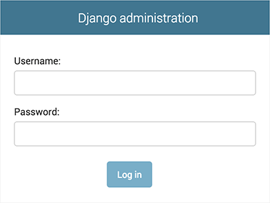
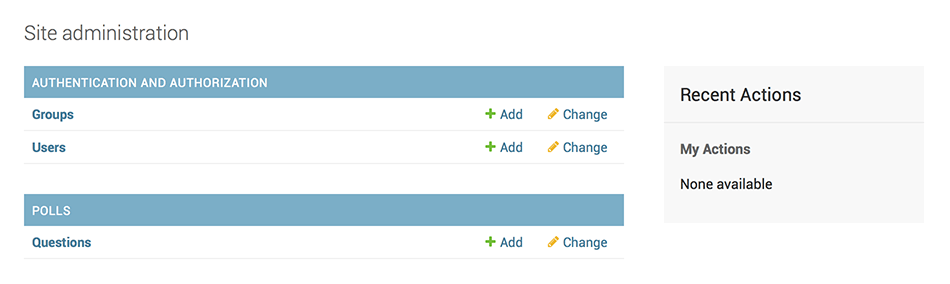
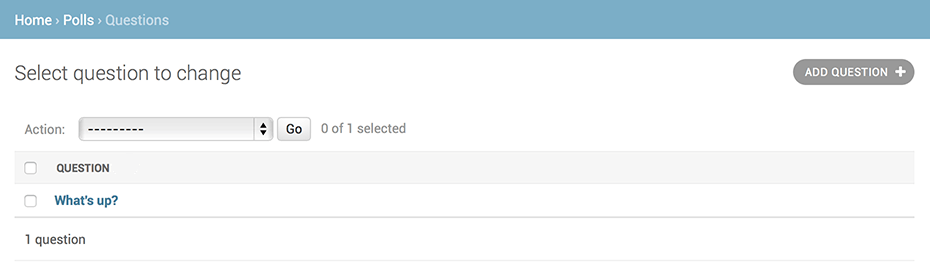
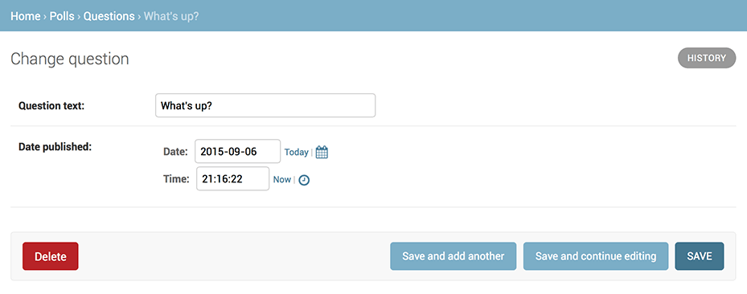
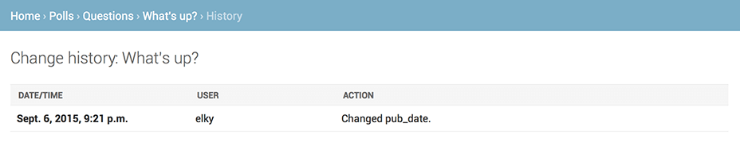

# Django Official Docs Project

- [Django Official Docs Project](#django-official-docs-project)
  - [0. Quick Install](#0-quick-install)
    - [Install Python](#install-python)
    - [Set up a database](#set-up-a-database)
    - [Install Django](#install-django)
      - [Verifying](#verifying)
  - [1. Writing first Django app](#1-writing-first-django-app)
    - [Creating a project](#creating-a-project)
    - [Development Server](#development-server)
      - [Changing the port](#changing-the-port)
    - [Creating the Polls app](#creating-the-polls-app)
      - [Project vs apps](#project-vs-apps)
    - [Write your first view](#write-your-first-view)
      - [When to use include()](#when-to-use-include)
      - [path() argument: route](#path-argument-route)
      - [path() argument: view](#path-argument-view)
      - [path() argument: kwargs](#path-argument-kwargs)
      - [path() argument: name](#path-argument-name)
  - [2. Working with the database](#2-working-with-the-database)
    - [Database setup](#database-setup)
    - [Creating models](#creating-models)
    - [Activating models](#activating-models)
    - [Playing with the API](#playing-with-the-api)
    - [Introducing the Django Admin](#introducing-the-django-admin)
      - [Creating an admin user](#creating-an-admin-user)
      - [Start the development server](#start-the-development-server)
      - [Enter the admin site](#enter-the-admin-site)
      - [Make the poll app modifiable in the admin](#make-the-poll-app-modifiable-in-the-admin)
      - [Explore the free admin functionality](#explore-the-free-admin-functionality)
  - [3. How to add more views to our polls app](#3-how-to-add-more-views-to-our-polls-app)
    - [Overview](#overview)

## 0. Quick Install

Before you can use Django, you’ll need to get it installed.

### Install Python

- Being a Python web framework, Django requires Python.
- Python includes a lightweight database called SQLite so you won’t need to set up a database just yet.
- Get the latest version of Python at [python.org/downloads/](https://www.python.org/downloads/) or with your operating system’s package manager.

__What Python version should I use with Django?__

- Since newer versions of Python are often faster, have more features, and are better supported, the latest version of Python 3 is recommended.
- You don’t lose anything in Django by using an older release, but you don’t take advantage of the improvements and optimizations in newer Python releases. Third-party applications for use with Django are free to set their own version requirements.

You can verify that Python is installed by typing `python` from your shell;

```py
python
python -V
python --version
```
you should see something like:
```shell
Python 3.x.y
[GCC 4.x] on linux
Type "help", "copyright", "credits" or "license" for more information.
>>>
```

### Set up a database

- This step is only necessary if you’d like to work with a “large” database engine like __PostgreSQL__, __MariaDB__, __MySQL__, or __Oracle__.

### Install Django

```shell
pip install django

# or

python -m pip install django
```

__pip version:__
```py
pip --version
```

#### Verifying

To verify that Django can be seen by Python, type __python__ from your shell. Then at the Python prompt, try to import Django:

```py
import django as dj
print(dj.get_version())

# or

python -m django --version
```

- If Django is installed, you should see the version of your installation. If it isn’t, you’ll get an error telling “No module named django”.

## 1. Writing first Django app

- Let's learn by creating a project.
- Throughout this tutorial, we’ll walk you through the creation of a basic poll application.
- It'll consist two parts:
  - A public site that lets people view polls and vote in them.
  - An admin site that lets you add, change, and delete polls.

### Creating a project

- If this is your first time using Django, you’ll have to take care of some initial setup. Namely, you’ll need to auto-generate some code that establishes a Django project – a collection of settings for an instance of Django, including database configuration, Django-specific options and application-specific settings.
- From the command line, __cd__ into a directory where you’d like to store your code, then run the following command:

```py
django-admin startproject mysite
```
- This will create a __mysite__ directory in your current directory.
- __Note:__ You’ll need to avoid naming projects after built-in Python or Django components. In particular, this means you should avoid using names like __django__ (which will conflict with Django itself) or __test__ (which conflicts with a built-in Python package).

Let’s look at what __startproject__ created:

```
mysite/
    manage.py
    mysite/
        __init__.py
        settings.py
        urls.py
        asgi.py
        wsgi.py
```

There files are:

- The outer `mysite/` root directory is a container for your project. Its name doesn’t matter to Django; you can rename it to anything you like.
- __`manage.py`__: A command-line utility that lets you interact with this Django project in various ways.
- The inner __mysite/__ directory is the actual Python package for your project. Its name is the Python package name you’ll need to use to import anything inside it (e.g. `mysite.urls`).
- __`mysite/__init__.py`__: An empty file that tells Python that this directory should be considered a Python package.
- __mysite/settings.py__: Settings/configuration for this Django project. Django settings will tell you all about how settings work.
- __mysite/urls.py__: The URL declarations for this Django project; a “table of contents” of your Django-powered site.
- __mysite/asgi.py__: An entry-point for ASGI-compatible web servers to serve your project.
- __mysite/wsgi.py__: An entry-point for WSGI-compatible web servers to serve your project.

### Development Server

Let’s verify your Django project works. Change into the outer __mysite__ directory, if you haven’t already, and run the following commands:

```shell
python manage.py runserver
```

You’ll see the following output on the command line:

```
Performing system checks...

System check identified no issues (0 silenced).

You have unapplied migrations; your app may not work properly until they are applied.
Run 'python manage.py migrate' to apply them.

January 26, 2023 - 15:50:53
Django version 4.1, using settings 'mysite.settings'
Starting development server at http://127.0.0.1:8000/
Quit the server with CONTROL-C.
```
- Ignore the warning about unapplied database migrations for now; we’ll deal with the database shortly.
- You’ve started the Django development server, a lightweight web server written purely in Python. We’ve included this with Django so you can develop things rapidly, without having to deal with configuring a production server – such as Apache – until you’re ready for production.
- Now’s a good time to note: __don’t__ use this server in anything resembling a production environment. It’s intended only for use while developing. (We’re in the business of making web frameworks, not web servers.)

Now that the server’s running, visit [http://127.0.0.1:8000/](http://127.0.0.1:8000/) with your web browser. You’ll see a “Congratulations!” page, with a rocket taking off. It worked!

#### Changing the port

- By default, the __runserver__ command starts the development server on the internal IP at port `8000`.
- If you want to change the server’s port, pass it as a command-line argument. For instance, this command starts the server on port 8080:

```shell
python manage.py runserver 8080
```

If you want to change the server’s IP, pass it along with the port. For example, to listen on all available public IPs (which is useful if you are running Vagrant or want to show off your work on other computers on the network), use:

```shell
py manage.py runserver 0.0.0.0:8000
```

__Automatic reloading of runserver:__
- The development server automatically reloads Python code for each request as needed. You don’t need to restart the server for code changes to take effect. However, some actions like adding files don’t trigger a restart, so you’ll have to restart the server in these cases. For Ex: in changing setting you need to restart runserver.

### Creating the Polls app

Now that your environment – a “project” – is set up, you’re set to start doing work.

- Each application you write in Django consists of a Python package that follows a certain convention. Django comes with a utility that automatically generates the basic directory structure of an app, so you can focus on writing code rather than creating directories.

#### Project vs apps

What’s the difference between a project and an app?

- An app is a web application that does something – e.g., a blog system, a database of public records or a small poll app.
- A project is a collection of configuration and apps for a particular website. A project can contain multiple apps. An app can be in multiple projects.

Your apps can live anywhere on your Python path. In this tutorial, we’ll create our poll app in the same directory as your __manage.py__ file so that it can be imported as its own top-level module, rather than a submodule of __mysite__.

To create your app, make sure you’re in the same directory as __manage.py__ and type this command:


```shell
python manage.py startapp polls
```
- That’ll create a directory __polls__, which is laid out like this:

```
polls/
    __init__.py
    admin.py
    apps.py
    migrations/
        __init__.py
    models.py
    tests.py
    views.py
```

- This directory structure will house the poll application.

### Write your first view

Let’s write the first view. Open the file __`polls/views.py`__ and put the following Python code in it:

```py
from django.http import HttpResponse

def index(request):
    return HttpResponse("Hello, world. You're at the polls index.")
```

- This is the simplest view possible in Django. To call the view, we need to map it to a URL - and for this we need a URLconf.

To create a URLconf in the polls directory, create a file called __`urls.py`__. Your app directory should now look like:

```
polls/
    __init__.py
    admin.py
    apps.py
    migrations/
        __init__.py
    models.py
    tests.py
    urls.py
    views.py
```

In the __`polls/urls.py`__ file include the following code:

```py
from django.urls import path

from . import views

urlpatterns = [
    path('', views.index, name='index'),
]
```

The next step is to point the root URLconf at the __`polls.urls`__ module. In __`mysite/urls.py`__, add an import for `django.urls.include` and insert an `include()` in the __urlpatterns__ list, so you have:

```py
from django.contrib import admin
from django.urls import include, path

urlpatterns = [
    path('polls/', include('polls.urls')),
    path('admin/', admin.site.urls),
]
```

- The __`include()`__ function allows referencing other URLconfs. Whenever Django encounters __`include()`__, it chops off whatever part of the URL matched up to that point and sends the remaining string to the included URLconf for further processing.
- The idea behind __`include()`__ is to make it easy to plug-and-play URLs. Since polls are in their own URLconf (polls/urls.py), they can be placed under “/polls/”, or under “/fun_polls/”, or under “/content/polls/”, or any other path root, and the app will still work.

#### When to use include()

You should always use `include()` when you include other URL patterns. __`admin.site.urls`__ is the only exception to this.

You have now wired an index view into the URLconf. Verify it’s working with the following command:

```shell
py manage.py runserver
```
- Go to [http://localhost:8000/polls/](http://localhost:8000/polls/) in your browser, and you should see the text “`Hello, world. You’re at the polls index.`”, which you defined in the __index__ view.

Page not found?
- If you get an error page here, check that you’re going to [http://localhost:8000/polls/](http://localhost:8000/polls/) and not `http://localhost:8000/`.

The __path()__ function is passed four arguments, two required: __route__ and __view__, and two optional: __kwargs__, and __name__. At this point, it’s worth reviewing what these arguments are for.

#### path() argument: route

__route__ is a string that contains a URL pattern. When processing a request, Django starts at the first pattern in __urlpatterns__ and makes its way down the list, comparing the requested URL against each pattern until it finds one that matches.

Patterns don’t search GET and POST parameters, or the domain name. For example, in a request to
- __`https://www.example.com/myapp/`__, the URLconf will look for __myapp/__. In a request to
- __`https://www.example.com/myapp/?page=3`__, the URLconf will also look for __myapp/__.

#### path() argument: view

When Django finds a matching pattern, it calls the specified view function with an __HttpRequest__ object as the first argument and any “captured” values from the route as keyword arguments. We’ll give an example of this in a bit.

#### path() argument: kwargs

Arbitrary keyword arguments can be passed in a dictionary to the target view. We aren’t going to use this feature of Django in the tutorial.

#### path() argument: name

- Naming your URL lets you refer to it unambiguously from elsewhere in Django, especially from within templates. This powerful feature allows you to make global changes to the URL patterns of your project while only touching a single file.

## 2. Working with the database

We’ll set up the database, create your first model, and get a quick introduction to Django’s automatically-generated admin site.

### Database setup

Now, open up __`mysite/settings.py`__. It’s a normal Python module with module-level variables representing Django settings.

- By default, the configuration uses __SQLite__. If you’re new to databases, or you’re just interested in trying Django, this is the easiest choice. SQLite is included in Python, so you won’t need to install anything else to support your database. When starting your first real project, however, you may want to use a more scalable database like PostgreSQL, to avoid database-switching headaches down the road.

- While you’re editing __`mysite/settings.py`__, set __TIME_ZONE__ to your time zone.
- Also, note the __INSTALLED_APPS__ setting at the top of the file. That holds the names of all Django applications that are activated in this Django instance. Apps can be used in multiple projects, and you can package and distribute them for use by others in their projects.

By default, __INSTALLED_APPS__ contains the following apps, all of which come with Django:

- __`django.contrib.admin`__ – The admin site. You’ll use it shortly.
- __`django.contrib.auth`__ – An authentication system.
- __`django.contrib.contenttypes`__ – A framework for content types.
- __`django.contrib.sessions`__ – A session framework.
- __`django.contrib.messages`__ – A messaging framework.
- __`django.contrib.staticfiles`__ – A framework for managing static files.

These applications are included by default as a convenience for the common case.

Some of these applications make use of at least one database table, though, so we need to create the tables in the database before we can use them. To do that, run the following command:

```shell
python manage.py migrate
```

- The __migrate__ command looks at the __INSTALLED_APPS__ setting and creates any necessary database tables according to the database settings in your __`mysite/settings.py`__ file and the database migrations shipped with the app (we’ll cover those later). You’ll see a message for each migration it applies.
- If you’re interested, run the command-line client for your database and type __\dt__ (PostgreSQL), __SHOW TABLES;__ (MariaDB, MySQL), __.tables__ (SQLite), or __SELECT TABLE_NAME FROM USER_TABLES;__ (Oracle) to display the tables Django created.

__For the minimalists:__

Like we said above, the default applications are included for the common case, but not everybody needs them. If you don’t need any or all of them, feel free to comment-out or delete the appropriate line(s) from __INSTALLED_APPS__ before running __migrate__. The __migrate__ command will only run migrations for apps in __INSTALLED_APPS__.

### Creating models

Now we’ll define your models – essentially, your database layout, with additional metadata.

__Philosophy:__

- A model is the single, definitive source of information about your data. It contains the essential fields and behaviors of the data you’re storing. Django follows the DRY Principle. The goal is to define your data model in one place and automatically derive things from it.
- This includes the migrations - unlike in Ruby On Rails, for example, migrations are entirely derived from your models file, and are essentially a history that Django can roll through to update your database schema to match your current models.

In our poll app, we’ll create two models: __Question__ and __Choice__.
1. A __Question__ has a question and a publication date.
2. A __Choice__ has two fields: the text of the choice and a vote tally. Each __Choice__ is associated with a __Question__.

These concepts are represented by Python classes. Edit the __`polls/models.py`__ file so it looks like this:

```py
from django.db import models


class Question(models.Model):
    question_text = models.CharField(max_length=200)
    pub_date = models.DateTimeField('date published')


class Choice(models.Model):
    question = models.ForeignKey(Question, on_delete=models.CASCADE)
    choice_text = models.CharField(max_length=200)
    votes = models.IntegerField(default=0)
```

Here, each model is represented by a class that subclasses __django.db.models.Model__. Each model has a number of class variables, each of which represents a database field in the model.

Each field is represented by an instance of a __Field__ class – e.g., __CharField__ for character fields and __DateTimeField__ for datetimes. This tells Django what type of data each field holds.

The name of each __Field__ instance (e.g. __question_text__ or __pub_date__) is the field’s name, in machine-friendly format. You’ll use this value in your Python code, and your database will use it as the column name.

You can use an optional first positional argument to a __Field__ to designate a human-readable name. That’s used in a couple of introspective parts of Django, and it doubles as documentation. If this field isn’t provided, Django will use the machine-readable name. In this example, we’ve only defined a human-readable name for __Question.pub_date__. For all other fields in this model, the field’s machine-readable name will suffice as its human-readable name.

Some __Field__ classes have required arguments. __CharField__, for example, requires that you give it a __max_length__. That’s used not only in the database schema, but in validation, as we’ll soon see.

A __Field__ can also have various optional arguments; in this case, we’ve set the __default__ value of __votes__ to 0.

Finally, note a relationship is defined, using __ForeignKey__. That tells Django each Choice is related to a single __Question__. Django supports all the common database relationships: many-to-one, many-to-many, and one-to-one.

### Activating models

That small bit of model code gives Django a lot of information. With it, Django is able to:
1. Create a database schema (__CREATE TABLE__ statements) for this app.
2. Create a Python database-access API for accessing __Question__ and __Choice__ objects.

But first we need to tell our project that the __polls__ app is installed.

__Philosophy:__

- Django apps are “pluggable”: You can use an app in multiple projects, and you can distribute apps, because they don’t have to be tied to a given Django installation.

To include the app in our project, we need to add a reference to its configuration class in the __INSTALLED_APPS__ setting. The __PollsConfig__ class is in the __polls/apps.py__ file, so its dotted path is __`'polls.apps.PollsConfig'`__. Edit the __mysite/settings.py__ file and add that dotted path to the __INSTALLED_APPS__ setting. It’ll look like this:

```py
INSTALLED_APPS = [
    'polls.apps.PollsConfig',
    'django.contrib.admin',
    'django.contrib.auth',
    'django.contrib.contenttypes',
    'django.contrib.sessions',
    'django.contrib.messages',
    'django.contrib.staticfiles',
]
```

Now Django knows to include the polls app. Let’s run another command:

```shell
python manage.py makemigrations polls
```

You should see something similar to the following:

```
Migrations for 'polls':
  polls/migrations/0001_initial.py
    - Create model Question
    - Create model Choice
```

By running __makemigrations__, you’re telling Django that you’ve made some changes to your models (in this case, you’ve made new ones) and that you’d like the changes to be stored as a migration.

Migrations are how Django stores changes to your models (and thus your database schema) - they’re files on disk. You can read the migration for your new model if you like; it’s the file __polls/migrations/0001_initial.py__. Don’t worry, you’re not expected to read them every time Django makes one, but they’re designed to be human-editable in case you want to manually tweak how Django changes things.

There’s a command that will run the migrations for you and manage your database schema automatically - that’s called __migrate__, and we’ll come to it in a moment - but first, let’s see what SQL that migration would run. The __sqlmigrate__ command takes migration names and returns their SQL:

```shell
python manage.py sqlmigrate polls 0001
```

You should see something similar to the following (we’ve reformatted it for readability):

```sql
BEGIN;
--
-- Create model Question
--
CREATE TABLE "polls_question" (
    "id" bigint NOT NULL PRIMARY KEY GENERATED BY DEFAULT AS IDENTITY,
    "question_text" varchar(200) NOT NULL,
    "pub_date" timestamp with time zone NOT NULL
);
--
-- Create model Choice
--
CREATE TABLE "polls_choice" (
    "id" bigint NOT NULL PRIMARY KEY GENERATED BY DEFAULT AS IDENTITY,
    "choice_text" varchar(200) NOT NULL,
    "votes" integer NOT NULL,
    "question_id" bigint NOT NULL
);
ALTER TABLE "polls_choice"
  ADD CONSTRAINT "polls_choice_question_id_c5b4b260_fk_polls_question_id"
    FOREIGN KEY ("question_id")
    REFERENCES "polls_question" ("id")
    DEFERRABLE INITIALLY DEFERRED;
CREATE INDEX "polls_choice_question_id_c5b4b260" ON "polls_choice" ("question_id");

COMMIT;
```

Note the following:

- The exact output will vary depending on the database you are using. The example above is generated for PostgreSQL.
- Table names are automatically generated by combining the name of the app (__polls__) and the lowercase name of the model – __question__ and __choice__. (You can override this behavior.)
- Primary keys (IDs) are added automatically. (You can override this, too.)
- By convention, Django appends __"_id"__ to the foreign key field name. (Yes, you can override this, as well.)
- The foreign key relationship is made explicit by a __FOREIGN KEY__ constraint. Don’t worry about the __DEFERRABLE__ parts; it’s telling PostgreSQL to not enforce the foreign key until the end of the transaction.
- It’s tailored to the database you’re using, so database-specific field types such as __auto_increment__ (MySQL), __bigint PRIMARY KEY GENERATED BY DEFAULT AS IDENTITY__ (PostgreSQL), or __integer primary key autoincrement__ (SQLite) are handled for you automatically. Same goes for the quoting of field names – e.g., using double quotes or single quotes.
- The __sqlmigrate__ command doesn’t actually run the migration on your database - instead, it prints it to the screen so that you can see what SQL Django thinks is required. It’s useful for checking what Django is going to do or if you have database administrators who require SQL scripts for changes.

If you’re interested, you can also run __python manage.py check__; this checks for any problems in your project without making migrations or touching the database.

Now, run __migrate__ again to create those model tables in your database:

```shell
py manage.py migrate
```
```
Operations to perform:
  Apply all migrations: admin, auth, contenttypes, polls, sessions
Running migrations:
  Rendering model states... DONE
  Applying polls.0001_initial... OK
```

The __migrate__ command takes all the migrations that haven’t been applied (Django tracks which ones are applied using a special table in your database called __django_migrations__) and runs them against your database - essentially, synchronizing the changes you made to your models with the schema in the database.

Migrations are very powerful and let you change your models over time, as you develop your project, without the need to delete your database or tables and make new ones - it specializes in upgrading your database live, without losing data. We’ll cover them in more depth in a later part of the tutorial, but for now, remember the three-step guide to making model changes:

- Change your models (in __models.py__).
Run __python manage.py makemigrations__ to create migrations for those changes
Run __python manage.py migrate__ to apply those changes to the database.

The reason that there are separate commands to make and apply migrations is because you’ll commit migrations to your version control system and ship them with your app; they not only make your development easier, they’re also usable by other developers and in production.

### Playing with the API

Now, let’s hop into the interactive Python shell and play around with the free API Django gives you. To invoke the Python shell, use this command:

```shell
python manage.py shell
```

- We’re using this instead of simply typing “python”, because manage.py sets the __DJANGO_SETTINGS_MODULE__ environment variable, which gives Django the Python import path to your __mysite/settings.py__ file.

Once you’re in the shell, explore the database API:

```py
>>> from polls.models import Choice, Question  # Import the model classes we just wrote.

# No questions are in the system yet.
>>> Question.objects.all()
<QuerySet []>

# Create a new Question.
# Support for time zones is enabled in the default settings file, so
# Django expects a datetime with tzinfo for pub_date. Use timezone.now()
# instead of datetime.datetime.now() and it will do the right thing.
>>> from django.utils import timezone
>>> q = Question(question_text="What's new?", pub_date=timezone.now())

# Save the object into the database. You have to call save() explicitly.
>>> q.save()

# Now it has an ID.
>>> q.id
1

# Access model field values via Python attributes.
>>> q.question_text
"What's new?"
>>> q.pub_date
datetime.datetime(2012, 2, 26, 13, 0, 0, 775217, tzinfo=datetime.timezone.utc)

# Change values by changing the attributes, then calling save().
>>> q.question_text = "What's up?"
>>> q.save()

# objects.all() displays all the questions in the database.
>>> Question.objects.all()
<QuerySet [<Question: Question object (1)>]>
```

Wait a minute. __<Question: Question object (1)>__ isn’t a helpful representation of this object. Let’s fix that by editing the __Question__ model (in the __polls/models.py__ file) and adding a ____str__()__ method to both __Question__ and __Choice__:

```py
from django.db import models

class Question(models.Model):
    # ...
    def __str__(self):
        return self.question_text

class Choice(models.Model):
    # ...
    def __str__(self):
        return self.choice_text
```

It’s important to add __`__str__()`__ methods to your models, not only for your own convenience when dealing with the interactive prompt, but also because objects’ representations are used throughout Django’s automatically-generated admin.

Let’s also add a custom method to this model:

```py
import datetime

from django.db import models
from django.utils import timezone


class Question(models.Model):
    # ...
    def was_published_recently(self):
        return self.pub_date >= timezone.now() - datetime.timedelta(days=1)
```

Note the addition of __`import datetime`__ and __`from django.utils import timezone`__, to reference Python’s standard __datetime__ module and Django’s time-zone-related utilities in __django.utils.timezone__, respectively.

Save these changes and start a new Python interactive shell by running __`python manage.py shell`__ again:

```py
>>> from polls.models import Choice, Question

# Make sure our __str__() addition worked.
>>> Question.objects.all()
<QuerySet [<Question: What's up?>]>

# Django provides a rich database lookup API that's entirely driven by
# keyword arguments.
>>> Question.objects.filter(id=1)
<QuerySet [<Question: What's up?>]>
>>> Question.objects.filter(question_text__startswith='What')
<QuerySet [<Question: What's up?>]>

# Get the question that was published this year.
>>> from django.utils import timezone
>>> current_year = timezone.now().year
>>> Question.objects.get(pub_date__year=current_year)
<Question: What's up?>

# Request an ID that doesn't exist, this will raise an exception.
>>> Question.objects.get(id=2)
Traceback (most recent call last):
    ...
DoesNotExist: Question matching query does not exist.

# Lookup by a primary key is the most common case, so Django provides a
# shortcut for primary-key exact lookups.
# The following is identical to Question.objects.get(id=1).
>>> Question.objects.get(pk=1)
<Question: What's up?>

# Make sure our custom method worked.
>>> q = Question.objects.get(pk=1)
>>> q.was_published_recently()
True

# Give the Question a couple of Choices. The create call constructs a new
# Choice object, does the INSERT statement, adds the choice to the set
# of available choices and returns the new Choice object. Django creates
# a set to hold the "other side" of a ForeignKey relation
# (e.g. a question's choice) which can be accessed via the API.
>>> q = Question.objects.get(pk=1)

# Display any choices from the related object set -- none so far.
>>> q.choice_set.all()
<QuerySet []>

# Create three choices.
>>> q.choice_set.create(choice_text='Not much', votes=0)
<Choice: Not much>
>>> q.choice_set.create(choice_text='The sky', votes=0)
<Choice: The sky>
>>> c = q.choice_set.create(choice_text='Just hacking again', votes=0)

# Choice objects have API access to their related Question objects.
>>> c.question
<Question: What's up?>

# And vice versa: Question objects get access to Choice objects.
>>> q.choice_set.all()
<QuerySet [<Choice: Not much>, <Choice: The sky>, <Choice: Just hacking again>]>
>>> q.choice_set.count()
3

# The API automatically follows relationships as far as you need.
# Use double underscores to separate relationships.
# This works as many levels deep as you want; there's no limit.
# Find all Choices for any question whose pub_date is in this year
# (reusing the 'current_year' variable we created above).
>>> Choice.objects.filter(question__pub_date__year=current_year)
<QuerySet [<Choice: Not much>, <Choice: The sky>, <Choice: Just hacking again>]>

# Let's delete one of the choices. Use delete() for that.
>>> c = q.choice_set.filter(choice_text__startswith='Just hacking')
>>> c.delete()
```

- For more information on model relations, see __Accessing related objects__.
- For more on how to use double underscores to perform field lookups via the API, see __Field lookups__.
- For full details on the database API, see our __Database API reference__.

### Introducing the Django Admin

__Philosophy:__

- Generating admin sites for your staff or clients to add, change, and delete content is tedious work that doesn’t require much creativity. For that reason, Django entirely automates creation of admin interfaces for models.

- Django was written in a newsroom environment, with a very clear separation between “content publishers” and the “public” site. Site managers use the system to add news stories, events, sports scores, etc., and that content is displayed on the public site. Django solves the problem of creating a unified interface for site administrators to edit content.

- The admin isn’t intended to be used by site visitors. It’s for site managers.

#### Creating an admin user

First we’ll need to create a user who can login to the admin site. Run the following command:

```shell
python manage.py createsuperuser
```

Enter your desired username and press enter.

```yml
Username: admin
```

You will then be prompted for your desired email address:

```yml
Email address: admin@example.com
```

The final step is to enter your password. You will be asked to enter your password twice, the second time as a confirmation of the first.

```yml
Password: **********
Password (again): *********
Superuser created successfully.
```

#### Start the development server

The Django admin site is activated by default. Let’s start the development server and explore it.

If the server is not running start it like so:

```shell
python manage.py runserver
```

Now, open a web browser and go to “/admin/” on your local domain – e.g., [http://127.0.0.1:8000/admin/](http://127.0.0.1:8000/admin/). You should see the admin’s login screen:



Since __translation__ is turned on by default, if you set __LANGUAGE_CODE__, the login screen will be displayed in the given language (if Django has appropriate translations).

#### Enter the admin site

Now, try logging in with the superuser account you created in the previous step. You should see the Django admin index page:


You should see a few types of editable content: groups and users. They are provided by __django.contrib.auth__, the authentication framework shipped by Django.

#### Make the poll app modifiable in the admin

But where’s our poll app? It’s not displayed on the admin index page.

Only one more thing to do: we need to tell the admin that __Question__ objects have an admin interface. To do this, open the __polls/admin.py__ file, and edit it to look like this:

```py
from django.contrib import admin

from .models import Question

admin.site.register(Question)
```

#### Explore the free admin functionality

Now that we’ve registered __Question__, Django knows that it should be displayed on the admin index page:



Click “Questions”. Now you’re at the “change list” page for questions. This page displays all the questions in the database and lets you choose one to change it. There’s the “What’s up?” question we created earlier:



Click the “What’s up?” question to edit it:



Things to note here:

- The form is automatically generated from the __Question__ model.
- The different model field types (__DateTimeField__, __CharField__) correspond to the appropriate HTML input widget. Each type of field knows how to display itself in the Django admin.
- Each __DateTimeField__ gets free JavaScript shortcuts. Dates get a “Today” shortcut and calendar popup, and times get a “Now” shortcut and a convenient popup that lists commonly entered times.

The bottom part of the page gives you a couple of options:

- __Save__ – Saves changes and returns to the change-list page for this type of object.
- __Save and continue editing__ – Saves changes and reloads the admin page for this object.
- __Save and add another__ – Saves changes and loads a new, blank form for this type of object.
- __Delete__ – Displays a delete confirmation page.

If the value of “Date published” doesn’t match the time when you created the question in Tutorial 1, it probably means you forgot to set the correct value for the __TIME_ZONE__ setting. Change it, reload the page and check that the correct value appears.

Change the “Date published” by clicking the “Today” and “Now” shortcuts. Then click “Save and continue editing.” Then click “History” in the upper right. You’ll see a page listing all changes made to this object via the Django admin, with the timestamp and username of the person who made the change:



## 3. How to add more views to our polls app

### Overview

A view is a “type” of web page in your Django application that generally serves a specific function and has a specific template. For example, in a blog application, you might have the following views:

- Blog homepage – displays the latest few entries.
- Entry “detail” page – permalink page for a single entry.
- Year-based archive page – displays all months with entries in the given year.
- Month-based archive page – displays all days with entries in the given month.
- Day-based archive page – displays all entries in the given day.
- Comment action – handles posting comments to a given entry.

In our poll application, we’ll have the following four views:

- Question “index” page – displays the latest few questions.
- Question “detail” page – displays a question text, with no results but with a form to vote.
- Question “results” page – displays results for a particular question.
- Vote action – handles voting for a particular choice in a particular question.

In Django, web pages and other content are delivered by views. Each view is represented by a Python function (or method, in the case of class-based views). Django will choose a view by examining the URL that’s requested (to be precise, the part of the URL after the domain name).


